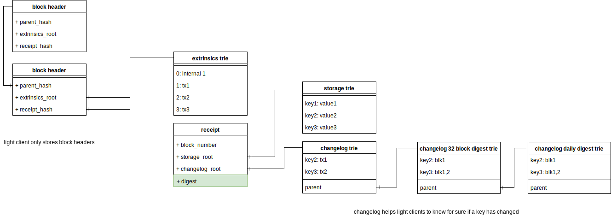

# substrate-doc
Some additional visual documentation for substrate complementing https://docs.substrate.dev/docs/

to edit these diagrams with draw.io go to https://www.draw.io/?mode=github
and open diagram. "save" commits back to github.

# Transaction lifetime 
What happens with a transaction when it is passed through RPC until it is included in a block?

* [x] reviewed by @shawntabrizi / @bkchr / @thomusdrw

## corresponding class diagram

# Architecture

## Service
the following components will be instanciated by the substrate service

TODO: still a bit chaotic

to learn more, study [these lines](https://github.com/paritytech/substrate/blob/7c95fb0bfd0b204e1200bf7e270538ba5e61e063/core/service/src/lib.rs#L94)

## Full Client
Components of a full client

TODO: light client components

# Blockchain Data Model

# Consensus
## Aura
Aura takes fixed turns to propose a new block.

only the authority who's turn it is proposes a new block

slot duration is a fixed number of seconds, to be evaluated on the autorities machines' time.

the slot proposer broadcasts his block, the others validate and import it and gossip about what they do.

TODO: compress diagram area

# SRML
All modules involved in Gav's coin flipping demo

TODO: simplify!
