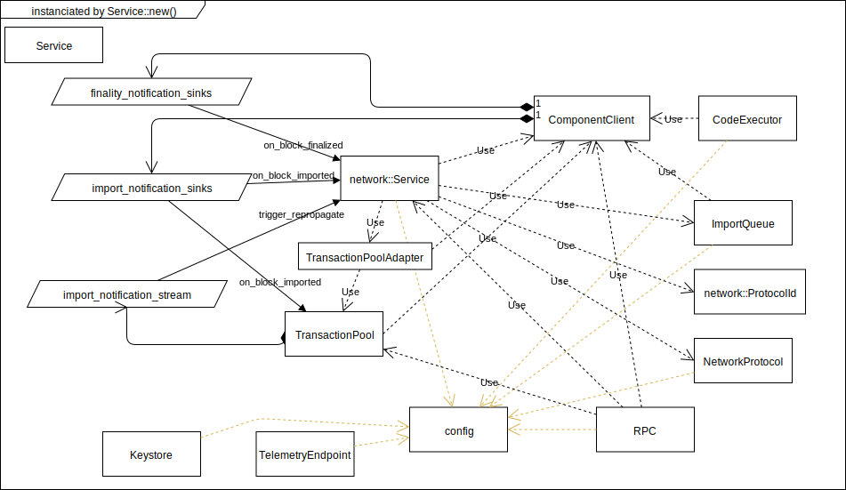

# substrate-doc
Documentation for substrate

to edit with draw.io go to https://www.draw.io/?mode=github
and open diagram. "save" commits back to github.

# Transaction lifetime 
transaction-sequence-diagram.svg

# Architecture

## Service
the following components will be instanciated by the substrate service

to learn more, study [these lines](https://github.com/paritytech/substrate/blob/7c95fb0bfd0b204e1200bf7e270538ba5e61e063/core/service/src/lib.rs#L94)

## Full Client
Components of a full client

